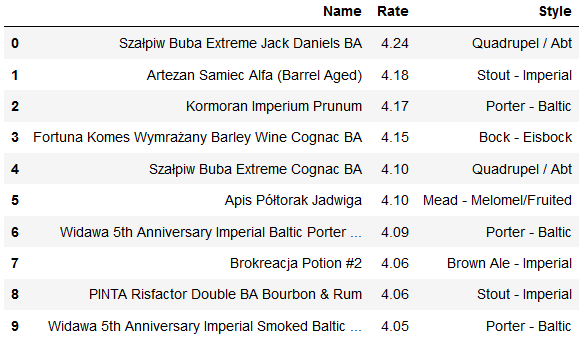
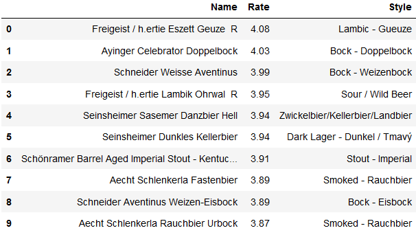
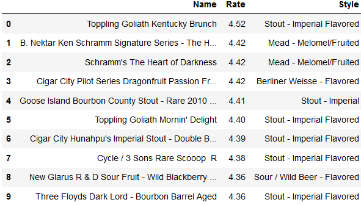
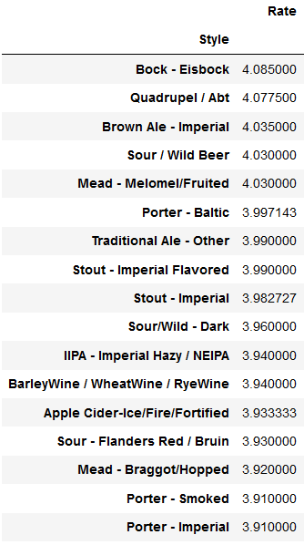
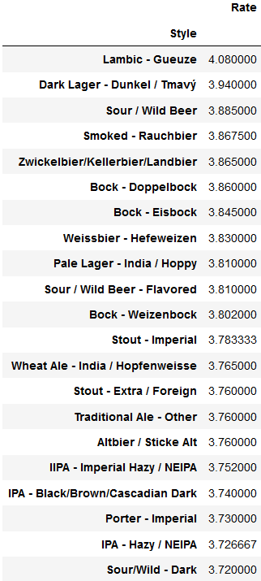
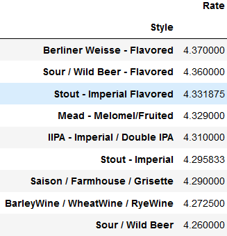

# Project Name

> Beer data analysis

  

## Table of contents

*  [General info](#general-info)

*  [Technologies](#technologies)

*  [Setup](#setup)

*  [Description](#description)

*  [Types od data](#types-of-data)

*  [Implementation](#implementation)

*  [Results](#results)

*   [Sources](#sources)

  

## General info

This is final project for my big data class. It involves webscrapping data about top 50 beers in each country. The data is limited to only 3 countries.

  

## Technologies

* Python 3.7.5

* Pandas

* BeautifulSoup

  

## Setup

To see the python code and output you need to install Jupyter Notebook.

  

## Description

This project sources data from one of the biggest sites, where users can share their opinion about certain beer and give it a rate. Project processes data about top 50 rated beers from three different countries. The main goal is to provide basic information including name of beer, its style and avarage rate from ratebeer users. Afterwards the data is processed to get result consisting of three different tables grouped by style of beer from each country. The business outcomes of such solution is to compare the information in the context of brewing industry and market economy in this line of business. There are main three issues, than can be analysed with this dataset.

a) What can be expected on our growing market of craft beer (according to ratings from american users, who generate trends for craft beer).

b) Which styles of beer are worth selling to certain counties.

c) What is the local demand for currently.

  

## Types of data

The data used in this project is secondary and human-sourced. Information about single beer is reported by breweries, and ratings are captured from users by the website.

  

## Implementation

For implementation few libraries were put to us such as „requests”, „BeautifulSoup” for web scrapping the information and „pandas” for visualisation of the data.

  

In order to gather the data and process it, undermentioned function was constructed:
```python

def  get_df(url):

names = []

rates = []

styles = []

page = requests.get(url)

soup = BeautifulSoup(page.text, 'html.parser')

table = soup.find('table')

rows = table.find_all('tr')

for row in rows:

if row == rows[0]:

continue

tds = row.find_all('td')

names.append(str(tds[1].text))

rates.append(str(tds[2].text))

styles.append(str(tds[4].text))

df = pd.DataFrame(list(zip(names, rates, styles)), columns = ['Name', 'Rate', 'Style'])

df['Rate'] = df['Rate'].astype('float')

return df

```

Function takes the url as an parameter to save the content of the website. With help of BeautifulSoup it locates the table and all of its rows from html file. For every row, except of the first one which is unwanted, it finds all the cells of the table and appends the text of selected ones to appropiate list. At the end the DataFrame is created from lists and returned. One of the columns’ datatype needs to be changed towards aggregation later.

  

The second step is to pass correct url to the function and get the dataframe:
```python

df_de = get_df('https://www.ratebeer.com/beer/country/germany/79/')

by_style_de = df_de.groupby('Style').mean().sort_values('Rate', ascending=False)

df_pl = get_df('https://www.ratebeer.com/beer/country/poland/163/')

by_style_pl = df_pl.groupby('Style').mean().sort_values('Rate', ascending=False)

df_usa = get_df('https://www.ratebeer.com/beer/country/united-states/213/')

by_style_usa = df_usa.groupby('Style').mean().sort_values('Rate', ascending=False)

```

## Results

Here are results of first 10 records of each country:

a) Poland


b) Germany


c) United States


Next the data was grouped by the style of beer and the rates were aggreated to avarage of each style.

a) Poland


b) Germany


c) United States


## Sources
https://www.ratebeer.com/beer/country/germany/79/  
https://www.ratebeer.com/beer/country/poland/163/  
https://www.ratebeer.com/beer/country/united-states/213/  
https://www.blazent.com/seven-characteristics-define-quality-data/

